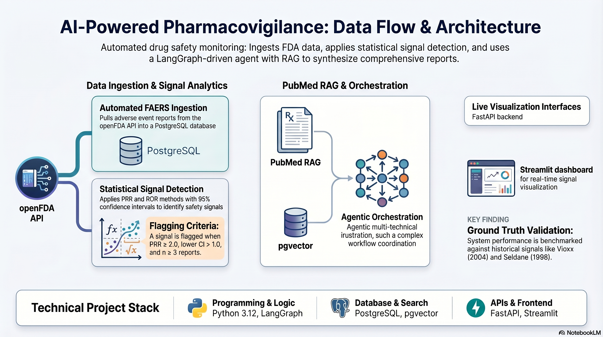

# 💊 pharmascope-ai

Drug safety intelligence platform — automated signal detection on FDA FAERS data.

[](https://github.com/esraersan/pharmascope-ai/actions)


---

## The problem

The FDA has 31 million adverse event reports. The Vioxx cardiovascular signal was sitting in that database for 5 years while 88,000 people had heart attacks. Nobody caught it in time.

pharmascope-ai automates the analysis. Type a drug name, get a signal report in seconds.

---

## Architecture



---

## Stack

- **Ingestion** — openFDA API → PostgreSQL
- **Signal Detection** — PRR + ROR with 95% CI
- **RAG** — PubMed semantic search via pgvector *(in progress)*
- **Agent** — LangGraph orchestration *(in progress)*
- **API** — FastAPI
- **Dashboard** — Streamlit

---

## Quickstart

```bash
git clone https://github.com/esraersan/pharmascope-ai
cd pharmascope-ai
pip install -e .
make dev
# new terminal
make streamlit
```

Dashboard → `http://localhost:8501`  
API docs → `http://localhost:8000/docs`

---

## Evaluation

Benchmarked against known historical signals:

| Drug | Event | Signal |
|------|-------|--------|
| Rofecoxib (Vioxx) | Myocardial infarction | ✅ Withdrawn 2004 |
| Terfenadine (Seldane) | Cardiac arrhythmia | ✅ Withdrawn 1998 |

