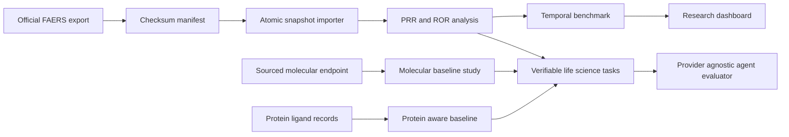

# Architecture

PharmaScope is a collection of connected, independently evaluated scientific
workflows. Shared infrastructure covers provenance, deterministic execution,
metrics, and documentation; evidence from one workflow is not silently treated
as a label for another.

## Trust boundaries

- Network retrieval is separate from statistical computation.
- Incomplete or checksum-mismatched FAERS imports are not analyzable.
- Generated artifacts are distinct from source-controlled benchmark
  definitions.
- Molecular and protein baselines cannot claim performance until run against a
  sourced dataset with a documented split.
- Agent answers are untrusted structured inputs to deterministic graders.

## Package boundaries

- `ingestion`: FAERS normalization and immutable snapshots.
- `signals`: report-level disproportionality statistics.
- `evaluation`: temporal pharmacovigilance benchmark.
- `molecular`: molecular safety baseline and split utilities.
- `protein`: protein–ligand baseline and generalization splits.
- `evals`: tool-using life-science task and grading contracts.
- `api` and `demo`: read-only presentation over complete snapshots and generated
  benchmark artifacts.
